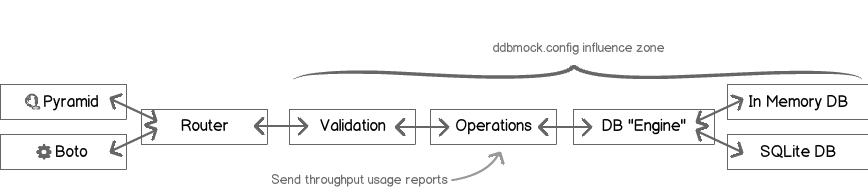

#######################
Extending DynamoDB-mock
#######################

Get the source Luke
===================

::

    $ hg clone ssh://hg@bitbucket.org/Ludia/dynamodb-mock
    $ pip install nose nosexcover coverage mock webtests boto
    $ python setup.py develop
    $ nosetests # --no-skip to run boto integration tests too

Folder structure
================

::

    DynamoDB-Mock
    +-- ddbmock
    |   +-- database    => request engine
    |   |   `-- storage => storage backend
    |   +-- operations  => each DynamoDB operation has a route here
    |   +-- router      => entry-points logic
    |   `-- validators  => request syntax validation middleware
    +-- docs
    |   `-- pages
    `-- tests
        +-- unit        => mainly details and corner cases tests
        `-- functional
            +-- boto    => main/extensive tests
            `-- pyramid => just make sure that all methods are supported

Request flow: the big picture
=============================

   Global request flow

Just a couple of comments here:

 - The ``router`` relies on introspection to find the validators (if any)
 - The ``router`` relies on introspection to find the routes
 - The ``database engine`` relies on introspection to find the configured storage backend
 - There is a "catch all" in the router that maps to DynamoDB internal server error

Adding a custom action
======================

As long as the method follows DynamoDB request structure, it is mostly a matter of
adding a file to ``ddbmock/routes`` with the following conventions:

 - file_name: "underscore" version of the camel case method name.
 - function_name: file_name.
 - argument: parsed post payload.
 - return: response dict.

Example: adding a ``HelloWorld`` method:

::

    # -*- coding: utf-8 -*-
    # module: ddbmock.routes.hello_world.py

    def hello_world(post):
        return {
            'Hello': 'World'
        }

If the ``post`` of your method contains ``TableName``, you may auto-load the
corresponding table this way:

::

    # -*- coding: utf-8 -*-
    # module: ddbmock.routes.hello_world.py

    from ddbmock.utils import load_table

    @load_table
    def hello_world(post):
        return {
            'Hello': 'World'
        }

Adding a validator
==================

Let's say you want to let your new ``HelloWorld`` greet someone in particular,
you will want to add an argument to the request.

Example: simplest way to add support for an argument:

::

    # -*- coding: utf-8 -*-
    # module: ddbmock.routes.hello_world.py

    def hello_world(post):
        return {
            'Hello': 'World (and "{you}" too!)'.format(you=post['Name'])
        }

Wanna test it?

>>> curl -d '{"Name": "chuck"}' -H 'x-amz-target: DynamoDB_custom.HelloWorld' localhost:6543
{'Hello': 'World (and "chuck" too!)'}

But this is most likely to crash the server if 'Name' is not in ``Post``. This is
where ``Voluptuous`` comes.

In ddbmock, all you need to do to enable automatic validations is to add a file
with the underscore name in ``ddbmock.validators``. It must contain a ``post``
member with the rules.

Example: HelloWorld validator for HelloWorld method:

::

    # -*- coding: utf-8 -*-
    # module: ddbmock.validators.hello_world.py

    post = {
        u'Name': unicode,
    }

Done !

Adding a storage backend
========================

Storage backends lives in 'ddbmock/database/storage'. There are currently two of
them built-in. Basic "in-memory" (default) and "sqlite" to add persistence.

As for the methods, storage backends follow conventions to keep the code lean

- they must be in ``ddbmock.database.storage`` module
- they must implement ``Store`` class following this outline

::

    # -*- coding: utf-8 -*-

    # in case you need to load configuration constants
    from ddbmock import config

    # the name can *not* be changed.
    class Store(object):
        def __init__(self, name):
            """ Initialize the in-memory store
            :param name: Table name.
            """
            # TODO

        def truncate(self):
            """Perform a full table cleanup. Might be a good idea in tests :)"""
            # TODO

        def __getitem__(self, (hash_key, range_key)):
            """Get item at (``hash_key``, ``range_key``) or the dict at ``hash_key`` if
            ``range_key``  is None.

            :param key: (``hash_key``, ``range_key``) Tuple. If ``range_key`` is None, all keys under ``hash_key`` are returned
            :return: Item or item dict

            :raise: KeyError
            """
            # TODO

        def __setitem__(self, (hash_key, range_key), item):
            """Set the item at (``hash_key``, ``range_key``). Both keys must be
            defined and valid. By convention, ``range_key`` may be ``False`` to
            indicate a ``hash_key`` only key.

            :param key: (``hash_key``, ``range_key``) Tuple.
            :param item: the actual ``Item`` data structure to store
            """
            # TODO

        def __delitem__(self, (hash_key, range_key)):
            """Delete item at key (``hash_key``, ``range_key``)

            :raises: KeyError if not found
            """
            # TODO

        def __iter__(self):
            """ Iterate all over the table, abstracting the ``hash_key`` and
            ``range_key`` complexity. Mostly used for ``Scan`` implementation.
            """
            # TODO

As an example, I recommend to study "memory.py" implementation. It is pretty
straight-forward and well commented. You get the whole package for only 63 lines :)
